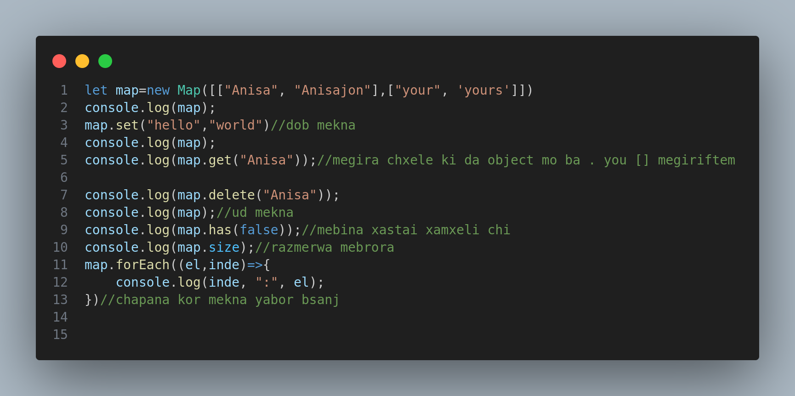
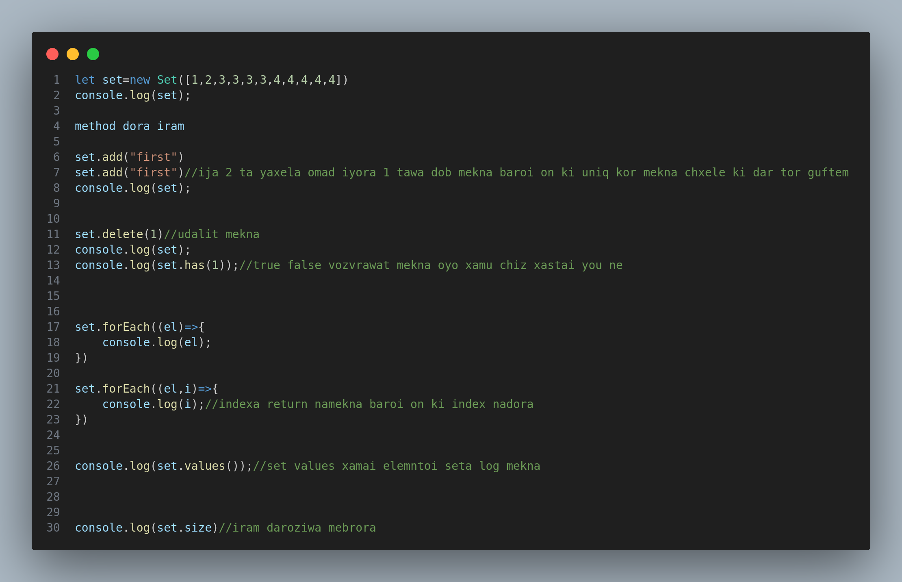
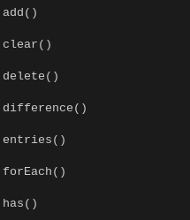

#### What is a new map in JavaScript?
>Map is a collection of keyed data items, just like an Object . But the main difference is that Map allows keys of any type. Methods and properties are: new Map() – creates the map. map.set(key, value)–stores the value by the key
###  `new Map()` ya colectioni elemntxo ki xam kluch xam znahchwniyaw da masiv miya rangi object.entries 1 svoistvara kl qati valuow yakjo mekna'
### masiva da new map roi knem moda obratno object roi mekna da new map kyubiuxel varieble monda mewava kolektioni masivora 1 svoista mekna (peoperti mkena object mekna)

`i eto imeet ~~key~~ i ~~vallue~~  kak i normalniy ~~object~~ no kak i my skazali vishe ono mozhet prinyat lyuboi tip v kachestve klyucha ya imeyu v vidu ili eto nachnyotsa s bukvi -minusovoi sifri ili symbol kak 👍 -eto`

```js

let map=new Map([[true,"hello"],[false,"world"]])
console.log(map);

map.set("hello", "world");//dobavit mekna value
console.log(map);
console.log(map.get(true));//get megira ai drunw aga nayova false meta ud namekna oobjecti mora
console.log(map.delete(true));//delete delte mekna

console.log(map.has(false));//true meta mesanja xastai you nestai

// object darozi nadora map dora agar map.size knem daroziwa meta
console.log(map.size);
```



```js
let map=new Map([["Anisa", "Anisajon"],["your", 'yours']])
console.log(map);
map.set("hello","world")//dob mekna
console.log(map);
console.log(map.get("Anisa"));//megira chxele ki da object mo ba . you [] megiriftem

console.log(map.delete("Anisa"));
console.log(map);//ud mekna
console.log(map.has(false));//mebina xastai xamxeli chi
console.log(map.size);//razmerwa mebrora
map.forEach((el,inde)=>{
    console.log(inde, ":", el);
})//chapana kor mekna yabor bsanj 

```





# What is new Sat in JS
>Sets in JavaScript are collections of unique values, meaning no duplicates are allowed. They provide efficient ways to store and manage distinct elements.
>[!TIP]
>`Nabory s pomoshyu set mi mozhem lekin iyo metonan danie lyuboi tipa qabul knan v kachestve vallues i esli povtorni wava i metona 1 giwa qabul kunad tamom va in misli object ast`
``` js
let a = new Set([1, 2, 3]);
let b = new Map([
  [1, "one"],
  [2, "two"],
  [4, "four"],
]);
console.log(a.union(b)); // Set(4) {1, 2, 3, 4}
```


``` js
let set1 = new Set([1, 2, 3, 4, 5]);

console.log(set1.has(1));
// Expected output: true

console.log(set1.has(5));
// Expected output: true

console.log(set1.has(6));
// Expected output: false
```

> i vot odin primer kak mi mozhem zabrat vallue s etogo masiva set mi ispolzuem ~~set~~
``` js
let mySet = new Set();
mySet.add(1); // Set [ 1 ]
```
>a spomoshyu add mi dobovlyaem chto to


i v etom set est svoista kak i v objecte 


```js

// new Sat iram kolektion judo mekna lekin unikalniowa megira 

let set=new Set([1,2,3,3,3,3,4,4,4,4,4])
console.log(set);

// method dora iram 

set.add("first")
set.add("first")//ija 2 ta yaxela omad iyora 1 tawa dob mekna baroi on ki uniq kor mekna chxele ki dar tor guftem
console.log(set);


set.delete(1)//udalit mekna
console.log(set);
console.log(set.has(1));//true false vozvrawat mekna oyo xamu chiz xastai you ne


set.forEach((el)=>{
    console.log(el);
})

set.forEach((el,i)=>{
    console.log(i);//indexa return namekna baroi on ki index nadora
})


console.log(set.values());//set values xamai elemntoi seta log mekna


console.log(set.size)//iram daroziwa mebrora
```
